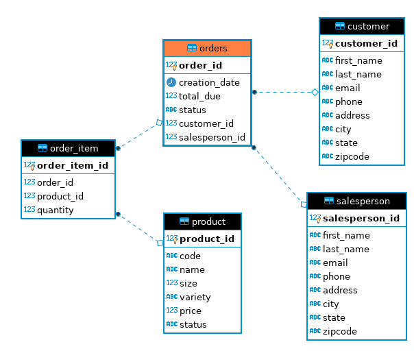

# Introduction

Java Database Connectivity (JDBC) is one of the most fundamental and frequently used Java libraries. JDBC allows the users to make a connection between a Java application and an RDBMS. Precisely, JDBC is dockerized using the PostgreSQL instance to make CRUD (Create, Read, Update, Delete) operation possible. CRUD operations work using the DAO (Data Access Object) patterns.

# ER Diagram

# Design Patterns

This project discusses two design patterns that are used to implement the abstraction layer between Java and the RDMBS. These are DAO and Repository pattern. The data access patterns mentioned, encapsulate the logic required to perform CRUD. The main difference between these two patterns is that the repository pattern focuses only on single table access per class, while in DAO multiple data tables can be accessed.
- DAO: Data persistence abstraction, closer to the database usually centered on a table. Better used for normalized data and vertical-scaling systems.
- Repository: Abstraction of collection of objects, closer to the domain i.e., being only aggregate roots. Better used for denormalized data and horizontal scaling systems as it can access single tables from various databases.
