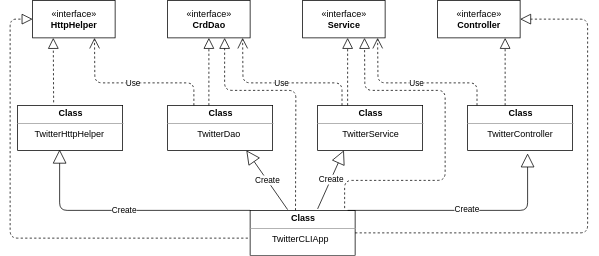

# Introduction
This is an implementation of the java app which can post/show/delete Twitter post via Twitter REST API. It allows the creation of a tweet with a geotag and outputs the created tweet object (simplified version) in JSON  format. The application checks for valid inputs and prints error an exception if tweet_text length is over 140 characters or geo tag is invalid (latitude or longitude is out of range). The TwitterCLIApp is designed with MVC (minus V) architecture. Below are some key aspects of the application:
- Design patterns: DTO, CRUD, DAO, and MVC.
- Java libraries used: HTTP Client and JSON.
- Frameworks(Test): JUnit and Mockito.
- Spring framework. 

# Quick Start
## Packaging the add using maven
1) Set the required Twitter authorization keys as environmental variables via IntelliJ or by exporting them on the command line.
    ````bash
    export consumerKey=key1
    export consumerSecret=key2
    export accessToken=key3
    export tokenSecret=key4
    ````
2) Use command `mvn package` to build package.
3) Run the application using:
     `java -jar target/ twitter-1.0-SNAPSHOT.jar [post|show|delete] [arguments]`

## Run Application - Usage
- Post tweet: `twitterCLIApp post "some text" "Longitude:Latitude"`
- Show tweet: `twitterCLIApp show "id"`
- Delete tweet: `twitterCLIApp delete "tweetId1,tweetId2,tweetId3..."`

# Design
## UML Diagram



- TwitterHttpHelper: Uses the interface HttpHelper to establish connections between the Twitter API and Java application. It uses the given URI to execute HTTP and authorizes the required HTTP request.
- TwitterDao: Calls TwitterHttpHelper and uses TwitterDAO to construct URIs from the tweet object.
- TwitterService: Handles the business logic of the application and, checks for valid tweet length, coordinates, ID and returns the Twitter object.
- TwitterController: Validates input from CLI and calls methods implemented in TwitterService method and parses the arguments.
- TwitterCLIApp: Takes input from the user via CLI and calls methods implemented in TwitterController.

# Models

Models are implemented with POJOs, which is a class with private member variables and public getter and setters. This class encapsulates Tweet data, which is often displayed in JSON format. A sample JSON output is given below:
````bash
"created_at" : "Thu Nov 28 20:11:33 +0000 2019",
  "id" : 1200145224103841792,
  "id_str" : "1200145224103841792",
  "text" : "test post",
  "entities" : {
    "hashtags" : [ ],
    "user_mentions" : [ ]
  },
  "retweet_count" : 0,
  "favorite_count" : 0,
  "favorited" : false,
  "retweeted" : false
}
````
The TwitterCLI application model is implemented using 5 POJOs namely: Tweet, Coordinates, Entities, Hashtag, UserMention.

# Spring

The TwitterCLIApp uses its main method to create components and dependencies. However, with an increasing  number of components, the management of the app becomes difficult. To resolve this issue, the app uses Spring framework.

**Beans**   
The Beans method defines dependency relationships through `@Bean` annotation and passes dependencies through method arguments. A Bean component is created by an IoC container, for instance, TwitterController, TwitterService, TwitterDAO, and TwitterHttpHelper.

**Component Scan**  
The Beans approach requires a lot of work and manual dependency specification. Here, an IoC container (dependency injection) is a process in which objects define their dependencies through constructor arguments. TwitterCLIComponentScan checks the whole project for all dependencies that the app context needs.

**Springboot**  
Springboot is an extension of the Spring framework. It eliminates the boilerplate configurations required when setting up a Spring application. TwitterCLISpringBoot configures Spring automatically.

# Improvements
- Using the complete tweet object in order to allow users to specify more fields.
- This app only posts texts. It could be improved to extend tweets to media and files.
- Adding an update tweet feature.
