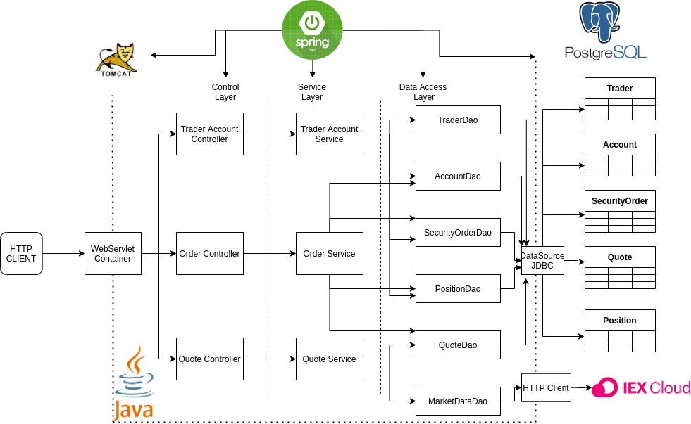
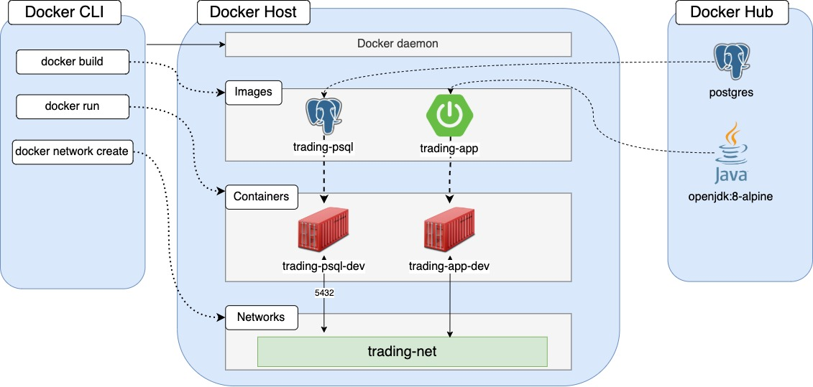

# Springboot Trading Application
Table of contents:
- Introduction
- Quick Start
- Architecture
- REST API Usage
- Docker Deployment
- Improvements

# Introduction
The Springboot trading application is a REST API application simulating an online stock trading platform. The application does CRUD operations on quotes, security orders, accounts, and traders. Users can use the IEX cloud as a data-source and store data in the PSQL database. The application uses MVC architecture along with the Spring framework deployed using Docker containers.

## Quick Start
Prequiresites: CentOS7 and Docker version 17.05 or higher.
Use the command below to confirm docker version.
````bash
docker -v
````

Docker Scripts:
- Setup APItoken as environment variable
````bash
export IEX_PUB_TOKEN="Insert your API Token here"
````
- Install latest Docker version
````bash
sudo yum remove -y docker \
                     docker-client \
                     docker-client-latest \
                     docker-common \
                     docker-latest \
                     docker-latest-logrotate \
                     docker-logrotate \
                     docker-engine
 
sudo yum install -y yum-utils device-mapper-persistent-data lvm2
   
sudo yum-config-manager \
       --add-repo \
       https://download.docker.com/linux/centos/docker-ce.repo
   
sudo yum -y install docker-ce docker-ce-cli containerd.io
````
- Building Docker images from given Dockerfiles
````Bash
cd ./springboot/psql
docker build -t trading-psl .
cd ./springboot
docker build -t trading-app .
````
- Running the Docker containers from the previously build images
````Bash
# Start the container 
# Attach it to the trading-net network
   docker run --name trading-psql-dev \
   -e POSTGRES_PASSWORD=password \
   -e POSTGRES_DB=jrvstrading \
   -e POSTGRES_USER=postgres \
   --network trading-net \
   -d -p 5432:5432 trading-psql

#start trading-app container which is attached to the trading-net docker network
docker run --name trading-app-dev \
-e "PSQL_URL=jdbc:postgresql://trading-psql-dev:5432/jrvstrading" \
-e "PSQL_USER=postgres" \
-e "PSQL_PASSWORD=password" \
-e "IEX_PUB_TOKEN=${IEX_PUB_TOKEN}" \
--network trading-net \
-p 5432:5432 -t trading-app
````

- The endpoints can be used with 
````Bash
http://localhost:5000/swagger-ui.html
````

## Architecture


- **Controller Layer** - This layer is responsible to handle the HTTP requests along with logic and application flow management. The Web Servlet maps each request to the corresponding service class. Note that the controller methods return the response as a JSON object instead of HTML.
- **Service Layer** - This layer handles all business logic. It validates input, resources, and performs the associated operations. The returned data is passed to the DAO layer for further processing.
- **DAO Layer** - This layer interacts with data models, persists and, retrieves data from the PostgreSQL source. This includes fetching data and saving data to the database and IEX Cloud.
- **Springboot/Tomcat** - Springboot has Tomcat server embedded which makes getting and setting up HTTP connections possible. Springboot is used to handle dependency injection for this application.
- **PostgreSQL** - This persists application data using the PSQL database. The information regarding stock exchanges is fetched from IEX Cloud and stored in the PSQL database under the corresponding tables.

## REST API Usage
### Swagger
Swagger UI is a collection of HTML, JavaScript, and CSS assets that dynamically generate beautiful documentation from a Swagger-compliant API.

### Quote Controller
This handles the requests regarding market quote updates from IEX cloud and storing the same in the PSQL database.
- GET `/quote/dailyList`: Lists all securities that are available for trading in this trading platform.
- GET `/quote/iex/ticker/{ticker}`: Retrieves and shows current quote of given ticker from IEX Cloud.
- POST `/quote/tickerId/{tickerId}`: Saves current quote of given ticker in the quote table of PostgreSQL database.
- PUT `/quote/`: Updates a given quote in the quote table.
- PUT `/quote/iexMarketData`:Fetches quotes from IEX and update all quotes from the quote table.

### Trader Controller
This is responsible for managing Trader and Acount information. It can create/delete an account along with withdraw/deposit funds to the account.
- POST `/trader/`: Creates a trader in the trader table along with associated account with 0 balance in the account table.
- POST `/trader/firstname/{firstname}/lastname/{lastname}/dob/{dob}/country/{country}/email/{email}`: Creates a trader in the trader table and an associated account with 0 balance in the account table.
- DELETE `/trader/traderId/{traderId}`: Deletes the trader with associated ID
- PUT `/trader/deposit/traderId/{traderId}/amount/{amount}`: Deposits fund into trader account. Returns 400 status code if the given fund is less than zero.
- PUT `/trader/withdraw/traderId/{traderId}/amount/{amount}`: Withdraws fund from trader account. Returns 400 status code for invalid function.

### Order Controller
This is responsible in handling market orders for specified securities.
- POST `/order/marketOrder`: Executes a market order with specified size, accountId and ticker.

## Docker Deployment

The Trading REST App can be dockerized for a more convenient deployment. For this, two docker images are used by this application i.e., trading-psql and trading-app. Trading-psql is built by pulling postgres. The image also contains all the necessary database and tables ready to be consumed by the trading-app. Trading-app is built by pulling Openjdk and maven images from Docker Hub. The container will compile and package the source code before starting the Java app. The trading-net (network) is created to make this application run by providing a communication link between containers.

## Improvements
- Addition of Dashboard controller.
- Addition of security authentication.
- Addition of UI for the application.
- Addition of key feature to enable trading among users.
- Addition of more API for stop/limit orders.
